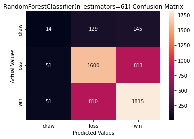
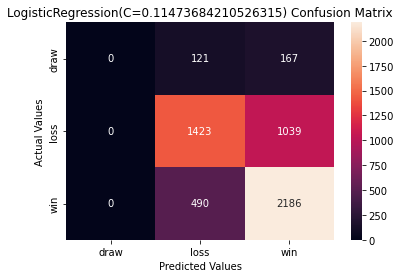

Braden Taack
### Chess Classification Project MVP
#### October 25th, 2021
___

#### MVP
  
Chess.com is a very popular website for playing chess online. It even has free educational lessons and offline bots to teach people about chess. When making an account to play online, each user will be assigned a rating. Chess.com starts all new players at 1200 and then, based on their performance, change it according to the Glicko system. While the Glicko system is intended to be an indicator of win probability based on the rating difference between 2 players, its single game predictability could be better. 

For this project, > 3 million games have been collected for 342 Chess.com streamers. Because this data set is so large and runs impossibly slow on my computer when trying to use it as a whole, I am taking samples in about 30,000 game batches to model and test with. To ensure a good distribution of player skill is being collected from, I am randomly choosing 3 players from 10 rating bins: (0,750),(750,1000),(1000,1250),(1250,1500),(1500,1750),(1750,2000),(2000,2250),(2250,2500), (2500,2750),(2750,3100). A random sample of 1000 games from those players is queried from the db for about 30000 games as the usable dataset. 

The data was initially stored into a mongoDB, due to the easy json formatting from the API. A pipeline was created to extract the data from the mongoDB and translate it into a more user-friendly pandas dataframe. The data was cleaned while in the pandas dataframe. 

The model is still in the feature engineering phase, but I have created a baseline model using just the Glicko ratings for each player in a game. Below are resulting confusion matricies after doing a grid search to find the best model for each type. 

Random Forest | Logistic
--------------|----------
Accuracy: 0.63| Accuracy: 0.66
 | 

#### Further Work  
I have much feature engineering to do in order to outperform the baseline model. I have statistics for player rating for each game type, their win/loss records, trainging data, and puzzle stats. I first need to build a pipeline to automatically gather this data for all players that show up in the sampled dataset, as I cannot garuantee that the streamers only play other streamers. Once this is completed, I will be able to build a more complex random forest model. 

I would also like to attempt a pipeline to be able to evaluate more complex features such as the players previous 10 game performance or personal history with another player. I may not have time to include both of these as the previous 10 games is proving troublesome due to the Epoch time formatting used by the API. 
