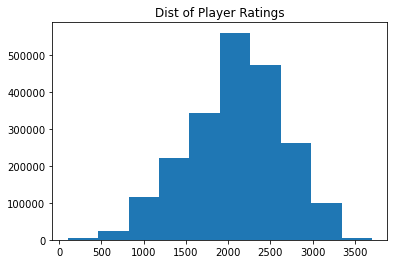

___
Braden Taack
###  Chess.com Classification Project Proposal 
#### October 20th, 2021
___
  

#### Question/need:
* What is the framing question of your analysis, or the purpose of the model/system you plan to build?   
  
  Chess.com is a very popular website for playing chess online. It even has free educational lessons and offline bots to teach people about chess. When making an account to play online, each user will be assigned a rating. Chess.com starts all new players at 1200 and then, based on their performance, change it according to the [Glicko system](https://www.chess.com/article/view/chess-ratings---how-they-work). While it can be intimidating playing against better rated players, or inflate one's hubris a little too much when playing against lower rated players, wouldn't it be nice to know the probability of winning a game? I intend to create a classification model that will help predict wether a player will win, lose, or draw in a game of chess. 
  
* Who benefits from exploring this question or building this model/system?  
  
  Anyone interested in an expected outcome of a game of chess could benefit from this model. While I have not explored the space myself, I am sure there are those out there that enjoy betting on chess games too. This model could help generate the odds for that platform. Personally, I am most interested in applying this model to tournaments and important games. Being able to predict winners and losers in a tournament style would be very interesting, especially to be able to quantify underdog stories. 
  
#### Data Description:
* What dataset(s) do you plan to use, and how will you obtain the data?  
  
  I have already generated my own dataset from the [Chess.com API](https://www.chess.com/news/view/published-data-api#pubapi-endpoint-games-archive-list). Currently, the dataset has 2.1 million games recorded from >200 streamers. I decided to focus on streamers specifically because I knew they would be consistently playing. I also hoped that they would be a large enough group to have a normal distribution when it came to rating. I did not want to overbias my model by only looking at grandmasters, for example. The following histogram confirmed my expectation for a near normal distribution of rating:
  
  

  
* What is an individual sample/unit of analysis in this project? What characteristics/features do you expect to work with?  
  
  An individual sample will be a game of chess. The target will be the game result for white (win, draw, or loss). The following will be the initial features of the table:  
  * Time Control (max length of game)
  * end_time (day and time when game concluded)
  * Rated (T/F whether or not the game was rated)
  * White Player Accuracy (% of how many moves did they make that were good)
  * Black Player Accuracy 
  * Initial Setup (how board looked at beginning)
  * End Setup (how board looked at end)
  * Time Class (style of game, blitz, regulary, daily moves, etc)
  * Rules Used
  * White Rating
  * White username
  * Black Rating
  * Black username
  
* If modeling, what will you predict as your target? 

  The target will be the result for the white player as a multiclass of Win, Draw, Loss. I hope to have a model that can predict with high confidence the outcome of a game for two players with a large rating difference. I expect that guessing the winner between 2 similar players will be closer to flipping a coin. 
  
#### Tools:
* How do you intend to meet the tools requirement of the project?  
  
  I have already created and stored my dataset in a local MongoDB that is sufficent in size. I plan to model this data using Sci-Kit learn with rigorous training and cross validation. I will likely not attempt a KNN model due to the size of my data. I will focus on using other methods such as logistic or random forest. I plan to use Seaborn or Plotly for data visualization, but ideally I would like to diploy my model to a simple streamlit web application. The main feature included on the application would be calculating game probabilities for user-specified players. 

#### MVP Goal:
* What would a [minimum viable product (MVP)](./mvp.md) look like for this project?  
  
  The goal for the MVP will be to have my data cleaned, and a basic logistic classification model created. I would like to have the confusion matrix and other metrics available for the model. 
  
#### Alternate Project Idea:
  
  Should this project be too difficult to overcome, I will resort to revisiting my Formula 1 project from the regression module. I would repurpose the data to build a better model with more appropriate classification tools. 
